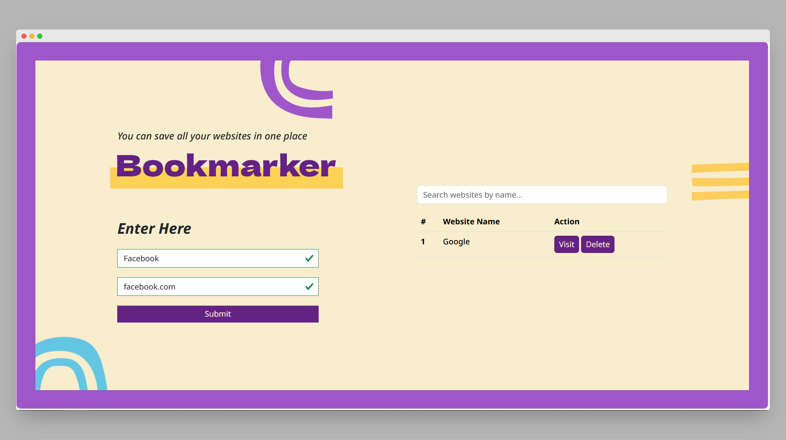

# Bookmarker Web App 🚀

A simple and responsive web application to save and manage your favorite websites in one place.

##  Features

-  Add websites with name and URL
-  Real-time search with "No results found" message
-  Responsive design (Bootstrap 5)
-  Data saved in browser using `localStorage`
-  Prevent duplicate entries
-  Delete websites individually
-  Input validation with visual feedback
-  Press "Enter" to add website quickly

##  Tech Stack

- HTML5
- CSS3 / Bootstrap 5
- JavaScript
- SweetAlert2 (for alerts)

##  Screenshots

##  What I Learned

- DOM manipulation and event handling
- Form validation and regex
- Using localStorage for persistent data
- Responsive UI with Bootstrap
- Improving UX with keyboard shortcuts and alerts

---

Feel free to contribute or suggest improvements 😊
